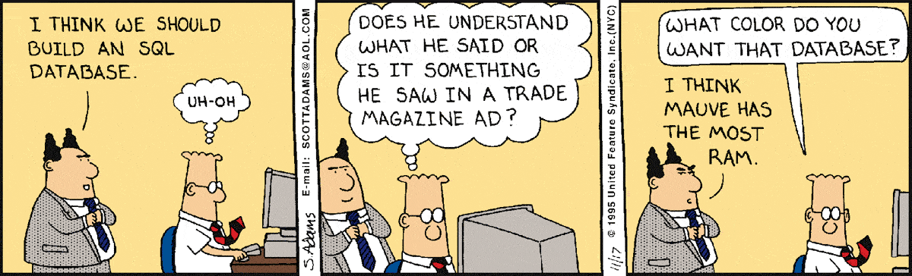

# Presistant B+tree

"Why use a fully functional optmized embedded database like sqlite3/uqlite when I can code my own?"

This is a start of an embedded database that i'm working on planning to implement all the features and optmizations in DBs like mongodb/uqlite/etc to better understand how things work under the hood.
